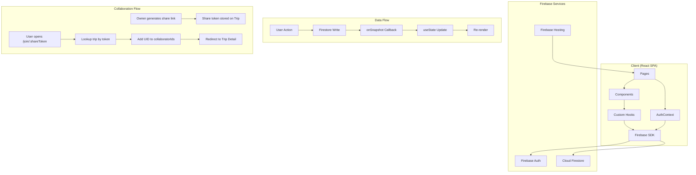

# Design Document: TripShare

## Overview

TripShare is a single-page application (SPA) for splitting trip expenses among participants with multi-user collaboration support. It uses React 19 with TypeScript, Vite for build tooling, and Firebase for the entire backend (auth, database, hosting). The architecture leverages Firebase's real-time capabilities to eliminate the need for a separate state management library — `onSnapshot` listeners in custom hooks provide live data and built-in optimistic UI.

The app supports a collaboration model where trip owners can generate share links to invite collaborators. Collaborators gain full expense CRUD access but cannot modify trip settings. The core domain logic (balance calculation, debt simplification, and participant protection) is implemented as pure functions, making them independently testable.

## Architecture



### Key Architectural Decisions

1. **No state management library**: Firebase `onSnapshot` provides real-time sync with latency compensation. Local writes trigger immediate UI updates before server confirmation, giving optimistic UI for free.

2. **Custom hooks for data access**: Each data concern (`useAuth`, `useTrips`, `useTrip`, `useExpenses`) encapsulates a Firestore listener. Components subscribe only to what they need, and listeners auto-unsubscribe on unmount. `useTrips` now queries both owned trips and collaborated trips.

3. **Pure domain logic**: Balance calculation, debt simplification, and participant protection checks are pure functions in `lib/`. They take expenses and participants as input and return computed results — no side effects, no Firebase dependency.

4. **Role-based UI rendering**: Components conditionally render based on whether the current user is the owner or a collaborator. This is determined by comparing `user.uid` against `trip.ownerId`.

5. **Share link via random token**: Share tokens are generated client-side using `crypto.randomUUID()`. The token is stored on the Trip document and forms the shareable URL path. Revoking sets the token to null.

6. **AuthContext for app-wide auth**: Auth state is needed for protected routes, role checks, and displaying user info in the header. A single context avoids prop drilling.

7. **react-router v7 for routing**: `createBrowserRouter` with route protection via `ProtectedRoute` wrapper. New `/join/:shareToken` route handles the collaboration join flow.

8. **Composite Firestore queries for dashboard**: The dashboard uses two queries (owned trips + collaborated trips) merged client-side, since Firestore doesn't support OR queries across different fields in a single query efficiently.

## Components and Interfaces

### Pages

| Page | Route | Responsibility |
|------|-------|----------------|
| `LoginPage` | `/login` | Google sign-in button, redirect if already authenticated |
| `DashboardPage` | `/` | List owned + collaborated trips, create trip dialog, empty state |
| `TripDetailPage` | `/trip/:tripId` | Expense list, add/edit expense form, balances, role-based controls |
| `JoinTripPage` | `/join/:shareToken` | Handle share link join flow, redirect after join |

### Layout Components

| Component | Props | Responsibility |
|-----------|-------|----------------|
| `Header` | — | App logo, user avatar + name, logout button |
| `ProtectedRoute` | `children` | Redirects to `/login` if unauthenticated |

### Trip Components

| Component | Props | Responsibility |
|-----------|-------|----------------|
| `TripCard` | `trip: Trip, role: 'owner' \| 'collaborator'` | Displays trip summary with role badge on dashboard |
| `TripForm` | `trip?: Trip, onSubmit, onCancel` | Create/edit trip form in dialog |
| `ParticipantInput` | `participants, expenses, onChange` | Dynamic add/remove name list with protection indicators |
| `CollaboratorList` | `collaboratorIds: string[]` | Displays collaborator avatars/names |
| `ShareLinkSection` | `trip: Trip, isOwner: boolean` | Generate/copy/revoke share link (owner only) |

### Expense Components

| Component | Props | Responsibility |
|-----------|-------|----------------|
| `ExpenseList` | `expenses: Expense[], participants: string[]` | Scrollable list of expenses |
| `ExpenseForm` | `expense?: Expense, participants: string[], onSubmit, onCancel` | Add/edit expense form |
| `ExpenseItem` | `expense: Expense, onEdit, onDelete` | Single expense row with actions |

### Balance Components

| Component | Props | Responsibility |
|-----------|-------|----------------|
| `BalanceSummary` | `balances: Record<string, number>` | Net balance per participant |
| `SettlementList` | `transactions: Transaction[]` | Simplified payment instructions |

### Custom Hooks

| Hook | Returns | Behavior |
|------|---------|----------|
| `useAuth()` | `{ user, loading, signIn, signOut }` | Wraps `onAuthStateChanged` |
| `useTrips()` | `{ trips, loading, error }` | Subscribes to owned + collaborated trips (two queries merged) |
| `useTrip(tripId)` | `{ trip, loading, error }` | Subscribes to single trip document |
| `useExpenses(tripId)` | `{ expenses, loading, error }` | Subscribes to trip's expenses subcollection |

### Lib Functions

| Function | Signature | Behavior |
|----------|-----------|----------|
| `calculateBalances` | `(expenses: Expense[], participants: string[]) => Record<string, number>` | Computes net balance for each participant |
| `simplifyDebts` | `(balances: Record<string, number>) => Transaction[]` | Greedy algorithm to minimize transactions |
| `isParticipantProtected` | `(name: string, expenses: Expense[]) => boolean` | Returns true if participant is referenced in any expense |
| `getRemovableParticipants` | `(participants: string[], expenses: Expense[]) => { removable: string[], protected: string[] }` | Categorizes participants by removability |
| `generateShareToken` | `() => string` | Returns `crypto.randomUUID()` |
| `buildShareLink` | `(token: string) => string` | Constructs the full share URL |
| `formatCurrency` | `(amount: number) => string` | Formats as `$X.XX` |
| `formatDate` | `(date: string) => string` | Human-readable date using date-fns |

## Data Models

### TypeScript Types

```typescript
interface Trip {
  id: string;
  ownerId: string;
  name: string;
  participants: string[];
  collaboratorIds: string[]; // UIDs of users who joined via share link
  shareToken: string | null; // random token for share link; null = revoked/disabled
  createdAt: Timestamp;
  updatedAt: Timestamp;
}

interface Expense {
  id: string;
  description: string;
  date: string; // YYYY-MM-DD
  amount: number; // positive, in dollars
  paidBy: string; // must be in parent trip's participants
  sharedBy: string[]; // non-empty subset of participants
  createdAt: Timestamp;
}

interface Transaction {
  from: string; // debtor
  to: string; // creditor
  amount: number; // positive, rounded to cents
}

interface UserProfile {
  uid: string;
  displayName: string | null;
  photoURL: string | null;
  email: string | null;
}

type TripRole = 'owner' | 'collaborator';
```

### Firestore Structure

```
trips/{tripId}
  ├── ownerId: string (user UID)
  ├── name: string
  ├── participants: string[]
  ├── collaboratorIds: string[] (UIDs of users who joined via share link)
  ├── shareToken: string | null
  ├── createdAt: Timestamp
  ├── updatedAt: Timestamp
  └── expenses/{expenseId}
        ├── description: string
        ├── date: string (YYYY-MM-DD)
        ├── amount: number
        ├── paidBy: string
        ├── sharedBy: string[]
        └── createdAt: Timestamp
```

### Firestore Security Rules

```
rules_version = '2';
service cloud.firestore {
  match /databases/{database}/documents {
    match /trips/{tripId} {
      // Read: owner or collaborator
      allow read: if request.auth != null && (
        resource.data.ownerId == request.auth.uid ||
        request.auth.uid in resource.data.collaboratorIds
      );

      // Create: authenticated user, ownerId must match
      allow create: if request.auth != null &&
        request.resource.data.ownerId == request.auth.uid;

      // Update: owner can update anything;
      // non-owner can ONLY add their own UID to collaboratorIds if shareToken matches
      allow update: if request.auth != null && (
        resource.data.ownerId == request.auth.uid ||
        (
          // Join via share link: user adds own UID to collaboratorIds
          request.resource.data.shareToken == resource.data.shareToken &&
          request.resource.data.ownerId == resource.data.ownerId &&
          request.resource.data.name == resource.data.name &&
          request.resource.data.participants == resource.data.participants &&
          request.auth.uid in request.resource.data.collaboratorIds &&
          !(request.auth.uid in resource.data.collaboratorIds)
        )
      );

      // Delete: owner only
      allow delete: if request.auth != null &&
        resource.data.ownerId == request.auth.uid;

      match /expenses/{expenseId} {
        // Read/Write: owner or collaborator of parent trip
        allow read, write: if request.auth != null && (
          get(/databases/$(database)/documents/trips/$(tripId)).data.ownerId == request.auth.uid ||
          request.auth.uid in get(/databases/$(database)/documents/trips/$(tripId)).data.collaboratorIds
        );
      }
    }
  }
}
```

### Validation Rules

| Field | Constraint |
|-------|-----------|
| `trip.name` | Non-empty string |
| `trip.participants` | Non-empty array of strings |
| `trip.collaboratorIds` | Array of strings (can be empty) |
| `trip.shareToken` | String or null |
| `expense.amount` | Positive number (> 0) |
| `expense.paidBy` | Must be in parent trip's `participants` |
| `expense.sharedBy` | Non-empty array, all values must be in parent trip's `participants` |
| `expense.date` | Valid date string in YYYY-MM-DD format |

## Correctness Properties

*A property is a characteristic or behavior that should hold true across all valid executions of a system — essentially, a formal statement about what the system should do. Properties serve as the bridge between human-readable specifications and machine-verifiable correctness guarantees.*

### Property 1: Balance conservation (zero-sum)

*For any* set of expenses with positive amounts and non-empty sharedBy lists, and any list of participants, the sum of all computed balances SHALL equal zero (within floating-point tolerance of $0.01).

**Validates: Requirements 10.1**

### Property 2: Settlement completeness

*For any* set of balances produced by `calculateBalances`, after applying all simplified settlement transactions from `simplifyDebts`, every participant's net position SHALL be zero (within rounding tolerance of $0.01).

**Validates: Requirements 11.1, 11.5**

### Property 3: Settlement minimality bound

*For any* set of balances with N non-zero participants (absolute value > $0.01), the number of settlement transactions produced by `simplifyDebts` SHALL be at most N-1.

**Validates: Requirements 11.1**

### Property 4: Payer balance attribution

*For any* single expense with a positive amount and a non-empty sharedBy list, `calculateBalances` SHALL increase the payer's balance by exactly the expense amount and decrease each sharer's balance by exactly (amount / number of sharers).

**Validates: Requirements 10.1**

### Property 5: Settlement threshold filtering

*For any* set of balances where all absolute values are below $0.01, `simplifyDebts` SHALL return an empty array of transactions.

**Validates: Requirements 11.3**

### Property 6: Settlement amount rounding

*For any* settlement transaction produced by `simplifyDebts`, the amount SHALL be a multiple of $0.01 (i.e., `amount * 100` is an integer within floating-point tolerance).

**Validates: Requirements 11.4**

### Property 7: Participant protection correctness

*For any* participant name and set of expenses, `isParticipantProtected` SHALL return true if and only if the participant name appears in at least one expense's `paidBy` field or in at least one expense's `sharedBy` array.

**Validates: Requirements 16.1, 16.2**

### Property 8: Dashboard trip visibility

*For any* user UID and set of Trip documents, the dashboard query logic SHALL return exactly those trips where the UID equals ownerId OR the UID is contained in collaboratorIds.

**Validates: Requirements 2.1**

## Error Handling

### Error Categories

| Category | Handling Strategy |
|----------|-------------------|
| Auth errors | Toast notification via sonner, stay on login page |
| Firestore read errors | Toast notification, show error state in hook |
| Firestore write errors | Toast notification, Firebase SDK rolls back optimistic update |
| Validation errors | Inline form validation messages, prevent submission |
| Network errors | Firebase SDK handles reconnection; onSnapshot resumes automatically |
| Invalid share link | Display error message on JoinTripPage, suggest requesting a new link |
| Join when already member | Silently redirect to trip detail without modifying data |

### Error Flow

1. **Component** calls a Firestore write operation (add, update, delete)
2. Firebase SDK applies optimistic update locally (onSnapshot fires immediately)
3. If server rejects the write, SDK reverts the local state (onSnapshot fires again with corrected data)
4. **Component** catches the promise rejection and shows an error toast

### Toast Notifications (sonner)

- **Success**: Trip created, expense added/edited/deleted, trip deleted, share link generated, share link copied, joined trip
- **Error**: Auth failure, write failure, invalid share link, participant removal blocked

## Testing Strategy

### Unit Tests (Vitest)

Focus on pure domain logic:
- `calculateBalances`: specific scenarios (single expense, multiple expenses, single participant pays all)
- `simplifyDebts`: known debt configurations, edge cases (all zero balances, single debtor/creditor)
- `isParticipantProtected`: specific cases (participant in paidBy, in sharedBy, in neither)
- `getRemovableParticipants`: categorization correctness
- `generateShareToken`: returns non-empty string
- `formatCurrency`: formatting edge cases
- Validation logic: empty names, zero amounts, empty shared-by arrays

### Property-Based Tests (fast-check + Vitest)

Property-based testing is well-suited for the balance calculation, debt simplification, participant protection, and dashboard filtering logic because:
- These are pure functions with clear input/output behavior
- Universal properties hold across a wide input space (any combination of expenses/participants)
- Input variation is large (amounts, participant counts, sharing configurations)
- Execution is cheap (in-memory pure computation)

**Configuration**:
- Library: `fast-check` with Vitest
- Minimum 100 iterations per property test
- Each test tagged with: `Feature: tripshare, Property N: [description]`

**Properties to test**:
1. Balance conservation (zero-sum)
2. Settlement completeness
3. Settlement minimality bound
4. Payer balance attribution
5. Settlement threshold filtering
6. Settlement amount rounding
7. Participant protection correctness
8. Dashboard trip visibility

### Integration Tests

- Component rendering with mocked Firebase hooks
- Form submission flows
- Role-based UI rendering (owner vs collaborator views)
- Join flow with mocked Firestore
- Route protection behavior

### Manual Testing

- Firebase Auth flow (requires real Google OAuth)
- Real-time sync across browser tabs (multiple users)
- Share link generation and join flow end-to-end
- Deployment to Firebase Hosting
